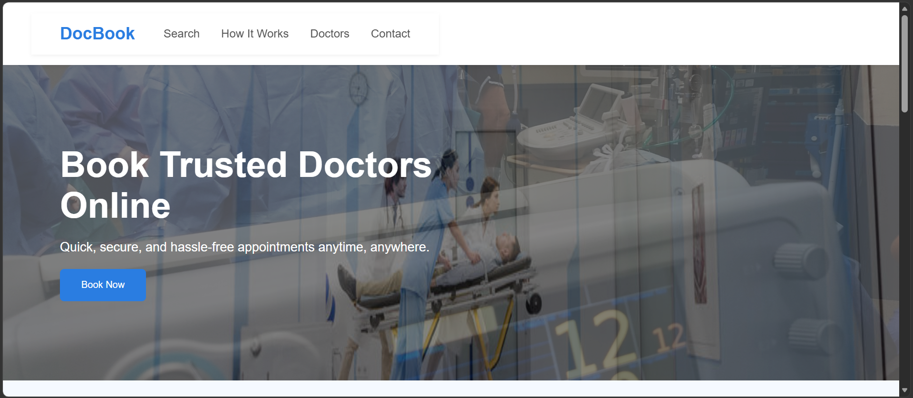
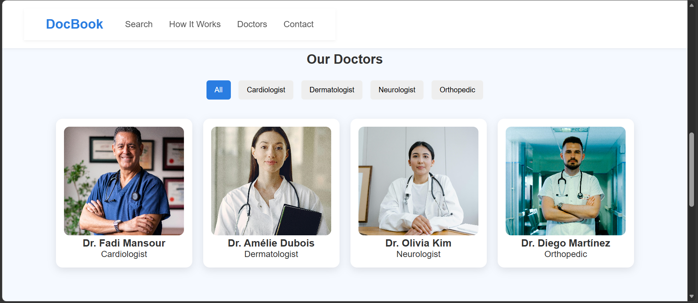
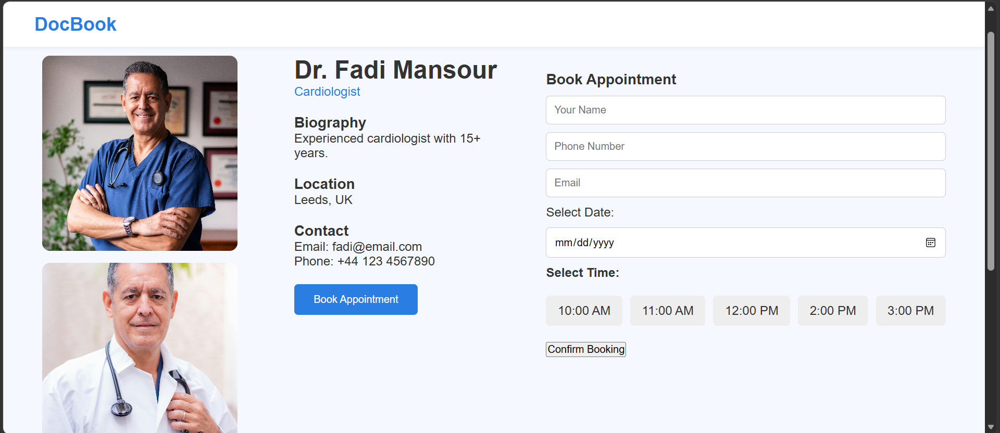

# DocBook – Online Doctor Appointment Booking Platform

DocBook is a responsive web application that allows patients to search for doctors, view their profiles, and book appointments online. It was built as a coursework project in collaboration with 2 classmates.

## 🔗 Live Demo
[comming soon]

## Features
- **Homepage** with a hero section and quick search bar (specialty, location, date)
- **How It Works** section outlining the booking process: Search → Book → Consult
- **Doctor Directory** with category filters (Cardiologist, Dermatologist, Neurologist, Orthopedic)
- **Doctor Profile Pages** showing biography, location, and contact details
- **Appointment Booking** with date picker and time-slot selection
- **Contact Page** with a message form for inquiries

## Tech Stack
- HTML5
- CSS3
- JavaScript (vanilla)

## My Contribution
Led development of the platform, building the majority of the site including the homepage, doctor search/filtering functionality, individual doctor profile pages, and the appointment booking system. Collaborated with 2 classmates on additional features and testing.

## Screenshots

### Homepage

### Doctor Directory

### Booking Flow

## Getting Started
To run this project locally:

1. Clone the repository
   \`\`\`bash
   git clone https://github.com/3affas/docbook.git
   \`\`\`
2. Open `Home_page.html` in your browser

No build steps or dependencies required — this is a static HTML/CSS/JS project.

## Contributors
- [Mohamed Amine Afas](https://github.com/3affas)
- [Rajat Khanal](https://github.com/methologysilver)
- [Ritu Ranjan Raut]
